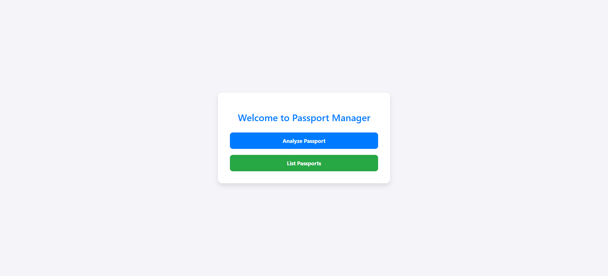

# 🛂 Passport Data Extraction with Azure Document Intelligence

This project is a web application built using **ASP.NET Core MVC** that integrates with **Azure Document Intelligence – ID Document Model** to automate the extraction of structured data from passport documents.

---

## 📌 Project Overview

**Azure Document Intelligence** (formerly Form Recognizer) is an AI service by Microsoft that extracts information from documents. The **ID Document model** specifically targets government-issued ID documents (passports, driver's licenses, etc.), pulling out details such as:

- Full name
- Date of birth
- Document number
- Expiry date
- Nationality
- And more...

This solution demonstrates how to combine Azure’s powerful document intelligence features with a modern web application for real-world use cases like **travel agencies**, **border control**, and **digital onboarding**.

---

## 🚀 Key Features

- 📤 Upload passport document (PDF, JPEG, PNG)
- 🔄 Send document via POST using `HttpClient`
- 🔐 Connect to Azure using endpoint, API key, and deployment model ID
- 📥 Retrieve and parse extraction results via response headers
- 🗃️ Store the structured passport data in a database
- 🧾 View and manage extracted passport records

---

## 🧰 Technologies Used

- ASP.NET Core MVC
- Azure Document Intelligence (ID Document Model)
- REST API Integration
- Entity Framework Core
- SQL Server (or any EF-supported DB)
- Bootstrap / Razor Views

---

## 🧑‍💻 How to Run This Project

```bash
# 1. Clone the Repository
git clone https://github.com/belal442002/PassportManager.git
cd PassportDataExtraction

# 2. Open the Solution
# Open the .sln file using Visual Studio 2022 or later.
# File structure:
# /PassportManager.sln
# /assets/
# /ProjectFolder/

# 3. Configure Azure Settings
# In appsettings.json, set the following values:

{
  "AzureDocumentIntelligence": {
    "Endpoint": "https://<your-resource-name>.cognitiveservices.azure.com/",
    "ApiKey": "<your-api-key>"
  }
}

# 4. Apply Database Migrations
dotnet ef database update

# 5. Run the Application
dotnet run --project DocumentIntelligence-Task


## 📷 Screenshots

Here’s a visual walkthrough of the project in action:

### 1. Home Page – Upload Passport  


### 2. File Selection & Upload  


### 3. Data Extraction in Progress  


### 4. Extracted Fields from Passport  


### 5. Stored Records View  


### 6. JSON Output from Azure  
